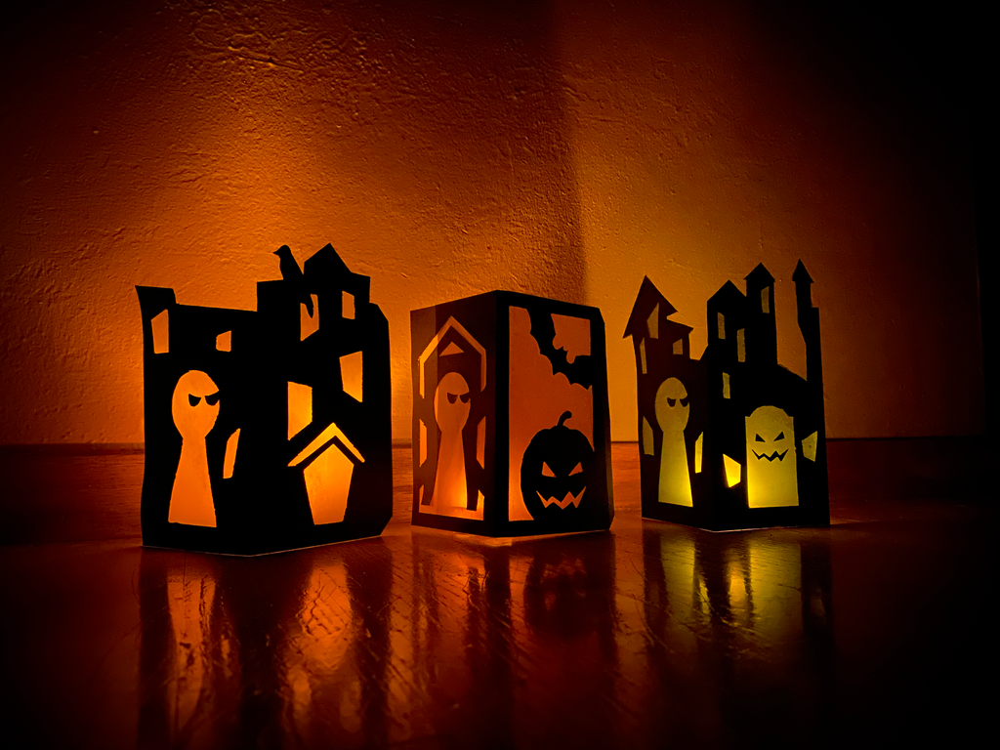

# Paranoid Halloween Lantern

Happy Halloween from the Paranoids! We’ve made these Paranoids Halloween lanterns for you to print and build. All you need is cardstock, tape, an xacto knife, an LED candle, and a bit of tissue paper. Take a look at [the instructions](./instructions.pdf) on how to build one!
